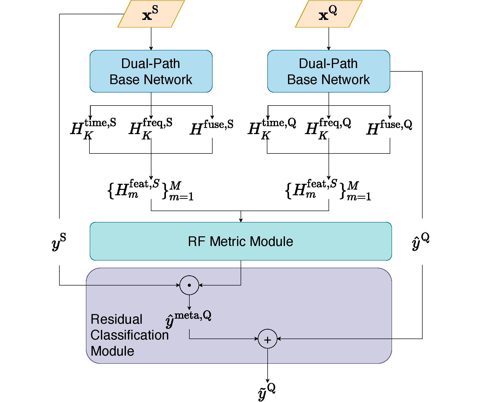
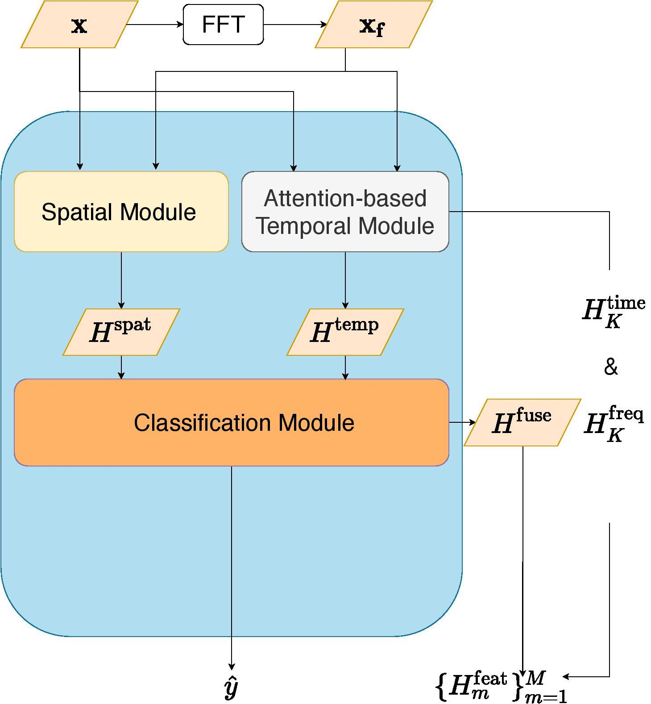

# RF-Net: A Unified Meta-Learning Framework for RF-enabledOne-Shot Human Activity Recognition

This repo contains the code and data of the following paper:
>**RF-Net: A Unified Meta-Learning Framework for RF-enabledOne-Shot Human Activity Recognition**, *Shuya Ding, Zhe Chen, Tianyue Zheng, Jun Luo*, Sensys2020 [[pdf]](link to be added)

# Overview 
<p align="center"></p> 
<p align="center"></p> 


# Abstract

Radio-Frequency(RF) based device-free Human Activity Recognition(HAR) rises as a promising solution for many Internet-of-Things(IoT) applications, such as elderly care and baby monitoring. 
However, device-free (or contactless) sensing is often more sensitive to environment changes than device-based (or wearable) sensing. Also, RF datasets strictly require on-line labeling during collection, starkly different from image and text data collections where human interpretations can be leveraged to perform off-line labeling. Consequently, existing learning algorithms to achieve RF-HAR entail a laborious process to gather sufficient data for being adaptive to new environments.
To this end, we propose RFNet as a meta-learning based neural network for one-shot RF-HAR, so that the labeling efforts for environment adaptation are reduced to the minimum level. In particular, we first examine three representative RF sensing techniques and two major meta-learning approaches. The results motivate us to innovate in two designs: i) a dual-path base HAR network, where both time and frequency domains are dedicated to learning powerful RF features including spatial and attention-based temporal ones, and ii) a metric-based meta-learning framework to enhance the fast adaption capability of the base network, including an RF-specific metric module along with a residual classification module. We conduct extensive experiments based on all three RF sensing techniques in multiple real-world indoor environments; all results strongly demonstrate the efficacy of RFNet compared with state-of-the-art baselines.
    
# Usage

- Please provide setting in config.py
- Run python main.py for training RF-Net


# Data Downloading

https://entuedu-my.sharepoint.com/:u:/g/personal/lamourdsy_staff_main_ntu_edu_sg/EQZRd2JtIqdLmh1zNDo2j6UBeeCc3KKbCBDPzoZOeGDRXw?e=Ym31OG
https://entuedu-my.sharepoint.com/:u:/g/personal/lamourdsy_staff_main_ntu_edu_sg/EVmM8HaNosZDrZswqhjghLkB3HADyB3ZzAh61r17LtDV5w?e=P989Zb


# Citing

If it is useful for your research, please consider cite the following reference paper:

```
Bibtext to be added
```

